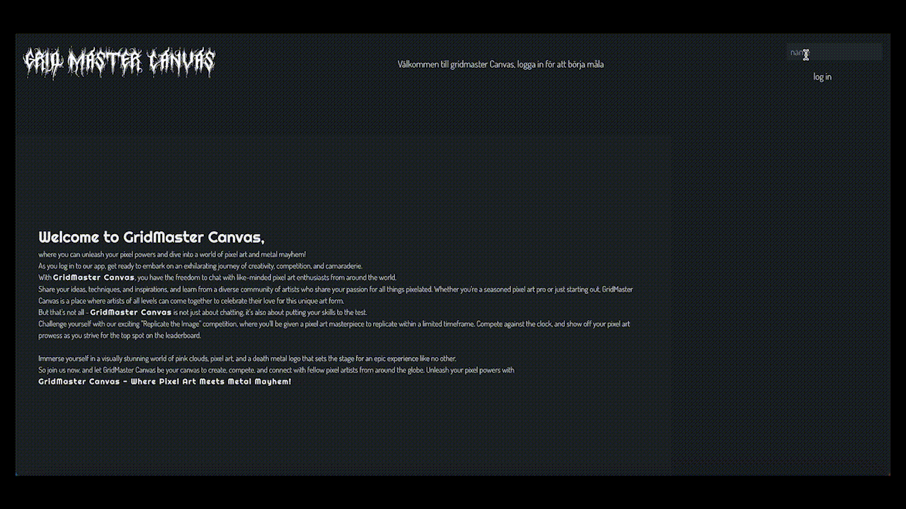

# Gridmaster Canvas

## Background
As a task in the API Development course at Medieinstitutet 2023, we were asked to create an online coloring application. The criteria were that the coloring should occur in real-time among all users logged into the application, with a minimum of 4 users, and that each user would be assigned a color and paint with that color. Coloring should occur in a grid with at least 15 columns and 15 rows, and the image should be able to be saved and opened again. There should also be a chat feature so that the 4 users coloring can also chat with each other.

## Demo


## Technology
Client: VITE, JavaScript, Sass

Server: Express, Mongoose, SOCKET.io, Nodemon, Cors, dotenv

## Details
A user logs in, is assigned a random color, and can start chatting directly with everyone who is logged in.

The username is sent to the server, and a user object is created, which is then sent back to the client and saved in sessionStorage, until the user leaves.
Dynamic text color in the chat depends on the random color the user has been assigned.

To play, the user creates a room. Here, you can paint with all other logged-in users with the color you have been assigned, and the number of users in the room can be determined on the server-side.
We wanted the entire project to be scalable, from dedicated users to easily requesting rooms for a specific number of users as well as open for everyone.

At this stage in the app, you can also save your image, which you can view by exiting the room and checking Saved Images in the Header.

To play games with others in a timed setting, you can create a room and then PLAY.
You will see a reference image, which is generated based on the number of users and colors in the room, and you/they will then color the grid according to the reference within the specified time. When the time is up, the user/users are notified of a score, and you can then exit the room and see your position on our highscore list.

Ongoing project, see ISSUES for bugs.

## Start the Project
Server:

If you have nodemon globally:
```bash 

nodemon start 

``` 

Otherwise, you can get nodemon via npm locally:

```bash 
 npm install --save-dev nodemon 

```

And start it via:

```bash 

npx nodemon 

``` 

You will need a running MongoDB server.

Create a .env file and fill in your details for

 ```bash 

PORT =  
CLIENT_URI =  

DATABASE_URI = 

``` 

To start the project in the client, you need to run the script:

 ```bash 

npm run dev 

``` 
